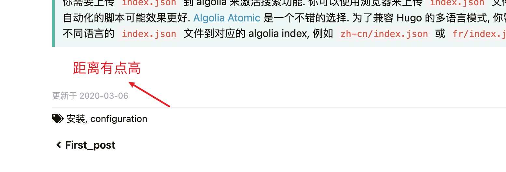
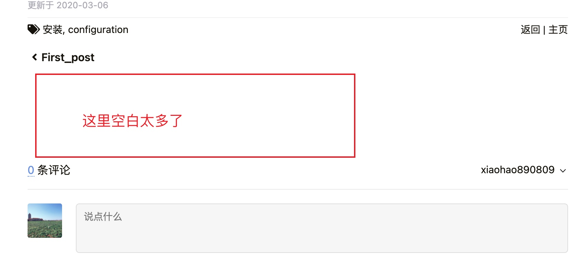

# 博客主题的相关记录


记录博客的搭建和使用中的一些问题和修改记录。
<!--more-->


本文使用的 `Loveit` 的主题，这个主题**非常全面**，包含了绝大部分的功能，有部分地方按照自己的习惯调整下。

## 博客文章的一些配置

`照片幻灯效果`

```markdown
lightgallery: true
```

`使用数学公式`

```markdown
math:
  enable: true
```

`目录自动展开`

```markdown
toc:
  auto: false
```

`目录关闭`

```markdown
toc:
  enable: false
```

`文章封面图片`

```markdown
resources:
- name: "featured-image"
  src: "featured-image.jpg"
```

`评论关闭`

```markdown
comment: 
   enable: false
```

`文章底部显示license`

```markdown
在文章钱的配置加上license: "<a rel='license external nofollow noopener noreffer' href='https://creativecommons.org/licenses/by-nc/4.0/' target='_blank'>CC BY-NC 4.0</a>"
```

## gitalk的bug

参考 [问题来源](https://github.com/dillonzq/LoveIt/issues/623) 这里修改对应的信息

去 [下载gitalk](https://github.com/gitalk/gitalk/tags) 这里下载最新版本。

> 更换 gittalk 的版本，使用 1.7.2 可以，修改的地方如下：<br>
/LoveIt/assets/data/cdn/jsdelivr.yml 修改版本号<br>
/LoveIt/assets/lib/VERSION 修改版本号<br>
/LoveIt/assets/lib/gitalk/gitalk.css 替换文件<br>
/LoveIt/assets/lib/gitalk/gitalk.min.js 替换文件

##	 搜索的索引

[algolia配置](https://www.algolia.com/apps/1FB3ER8IOA/explorer/browse/hz_blog?searchMode=search) 

## 其他介绍

[其他配置介绍](https://hugoloveit.com/zh-cn/about) 

## 页脚距离上面的距离



路径是 `asset->css>_partial->_single->_footer.css`

```css
.post-footer {
  margin-top: 3rem;
```

将 `3rem` 改为 `1rem`

## 评论上方空白太多



路径是 `asset->css>_partial->_single->_comment.css`

```css
#comments {
  padding: 8rem 0 2rem;
}

```

将 `8rem` 改为 `0rem`

## 分数

```markdown
[浅色]{?/}[深色]
[99]{?/}[100]
```

效果：

[浅色]/[深色] <br>
[99]/[100]

## 拼音

```markdown
[Hugo]{?^}(一个开源的静态网站生成工具)
```
效果：

[Hugo]^(一个开源的静态网站生成工具)

## 特殊标记

```markdown
{{?{}< version 0.2.0 >}}
```
效果：



## 横幅

```markdown
{?{}{< admonition type=tip title="This is a tip" open=false >}}
一个 **技巧** 横幅
{?{}{< /admonition >}}
或者
{{?{}< admonition tip "This is a tip" false >}}
一个 **技巧** 横幅
{{?{}< /admonition >}}	
```

效果：


一个 **技巧** 横幅
	

## 自定义向右

```markdown
{{?{}< style "text-align:right; strong{color:#00b1ff;}" >}}
This is a **right-aligned** paragraph.
{{?{}< /style >}}
```

效果：

{{< style "text-align:right; strong{color:#00b1ff;}" >}}
This is a **right-aligned** paragraph.



